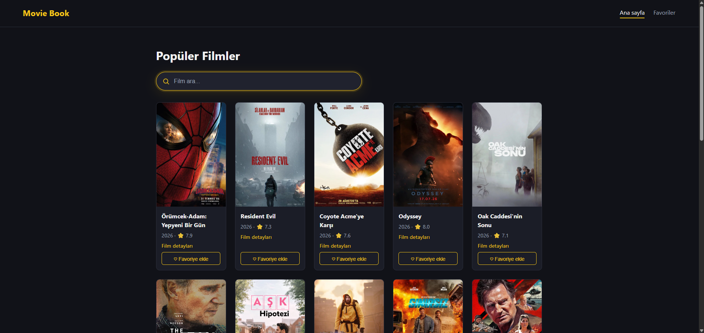

# Movie Book 🎬

TMDB API kullanan, React ile geliştirilmiş bir film rehberi uygulamasıdır. Popüler filmleri listeler, film aramaya izin verir, film detaylarını gösterir ve favori filmleri tarayıcıda saklar.

Bu proje, temel React bilgisini (component yapısı, props, state, routing, API'den veri çekme) pekiştirmek amacıyla geliştirilmiş bir front-end çalışmasıdır. Backend yoktur, tüm film verisi TMDB API'sinden gelir.



## Özellikler

- Popüler filmleri listeleme
- Film arama (debounce ile, her tuş vuruşunda istek atılmaz)
- Film detay sayfası: poster, özet, türler, süre, yıl ve puan
- Favorilere ekleme/çıkarma (LocalStorage, sayfa yenilense de kaybolmaz)
- Favoriler sayfası
- Yükleniyor, hata ve "film bulunamadı" durumları
- Posteri olmayan filmler için yedek görünüm
- Responsive, koyu temalı tasarım

## Ödev Gereksinimleri ve Karşılıkları

| Gereksinim         | Projedeki karşılığı                                                  |
| ------------------ | -------------------------------------------------------------------- |
| Component yapısı   | `MovieCard` tekrar kullanılabilir kart component'i                   |
| Props              | `MovieCard`'a `movie`, `isFavorite`, `onToggleFavorite` gönderilmesi |
| State              | `useState` ile film listesi, loading, error, arama metni, favoriler  |
| Routing            | `react-router-dom` ile `/`, `/movie/:id`, `/favorites`               |
| API'den veri çekme | `services/movieApi.js` içinde TMDB istekleri                         |
| LocalStorage       | `useFavorites` hook'u ile favorilerin saklanması                     |

## Kullanılan Teknolojiler

- React (Vite)
- React Router (`react-router-dom`)
- TMDB API
- LocalStorage
- CSS (Grid, Flexbox, CSS değişkenleri)
- ESLint

## Kurulum

Gereksinimler: Node.js (LTS veya üzeri) ve bir TMDB API key.

```bash
git clone [https://github.com/Eminkrdmn/movie-book-ky]
cd movie-book-ky
npm install
```

Proje kök klasörüne `.env` dosyası oluştur:

```
VITE_TMDB_API_KEY=senin_tmdb_api_keyin
VITE_TMDB_BASE_URL=https://api.themoviedb.org/3
VITE_TMDB_IMAGE_URL=https://image.tmdb.org/t/p/w500
```

API key'i [TMDB hesap ayarlarından](https://www.themoviedb.org/settings/api) alabilirsin. `.env` dosyası `.gitignore`'a ekli olduğu için GitHub'a gitmez.

Geliştirme sunucusunu başlat:

```bash
npm run dev
```

Uygulama `http://localhost:5173` adresinde açılır.

## Proje Yapısı

```
movie-book-ky/
├── public/
├── src/
│   ├── components/
│   │   └── MovieCard.jsx
│   ├── hooks/
│   │   └── useFavorites.js
│   ├── pages/
│   │   ├── Home.jsx
│   │   ├── Favorites.jsx
│   │   └── MovieDetails.jsx
│   ├── services/
│   │   └── movieApi.js
│   ├── App.jsx
│   ├── index.css
│   └── main.jsx
├── .env
└── package.json
```

Ödevdeki iskelet yapıya ek olarak `hooks/` klasörü eklendi. Favori mantığı (`localStorage` okuma/yazma, ekle/çıkar) tek bir custom hook'ta toplandı, böylece `Home`, `Favorites` ve `MovieDetails` aynı kodu kullanıyor.

## Dosyaların Görevleri

- `main.jsx`: Uygulamayı başlatır, `BrowserRouter` ile sarar
- `App.jsx`: Menü ve sayfa rotalarını tanımlar
- `pages/Home.jsx`: Popüler filmler ve arama
- `pages/MovieDetails.jsx`: URL'deki `id`'ye göre tek filmin detayı
- `pages/Favorites.jsx`: Kaydedilen favori filmler
- `components/MovieCard.jsx`: Tek bir film kartı
- `services/movieApi.js`: `getPopularMovies`, `searchMovies`, `getMovieDetails`, `getPosterUrl`
- `hooks/useFavorites.js`: Favori listesini yöneten custom hook

## Rotalar

| Yol          | Sayfa                               |
| ------------ | ----------------------------------- |
| `/`          | Ana sayfa (popüler filmler + arama) |
| `/movie/:id` | Film detayı                         |
| `/favorites` | Favoriler                           |

## Öğrenilenler

- Component'leri ve props ile veri aktarımını kullanma
- `useState` ve `useEffect` ile veri akışı yönetme
- `async/await` ile REST API'den veri çekme ve hata yakalama
- `react-router-dom` ile sayfa yenilemeden geçiş, `useParams` ile URL parametresi okuma
- Custom hook yazma
- Debounce ile gereksiz API isteklerini azaltma
- `.env` ile API key'i koddan ayırma

---

Bu ürün TMDB API'sini kullanır ancak TMDB tarafından onaylanmamıştır.
